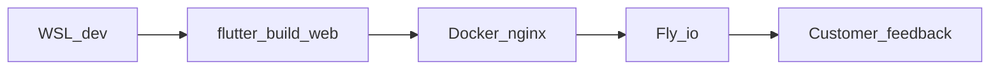

# Web-First App on Fly.io

## Locked decisions

- **Platform now:** Flutter **web only** for development, validation, and customer feedback.
- **Publish to:** [Fly.io](https://fly.io) (static Flutter `build/web` served by nginx).
- **Rename:** [`apps/mobile`](apps/mobile) → **`apps/web`**.
- **Native later:** Android/iOS packaging is **out of scope** until after feedback; remove packaging-oriented Android references from active docs/scripts/UI stubs.
- **Vision doc:** Leave [`docs/vision/complete-idea-summary.md`](docs/vision/complete-idea-summary.md) as long-term product SoT (offline/native future remains valid there). Do **not** rewrite the whole vision; only stop treating native as current delivery.

## 1. Rename `apps/mobile` → `apps/web`

- Move/rename the Flutter project directory to [`apps/web`](apps/web).
- Update [`scripts/_lib.sh`](scripts/_lib.sh): rename `mobile_dir` → `web_dir` pointing at `apps/web`.
- Update [`scripts/setup.sh`](scripts/setup.sh), [`localrun.sh`](scripts/localrun.sh), [`test.sh`](scripts/test.sh), [`wsldeploy.sh`](scripts/wsldeploy.sh), [`dev.sh`](scripts/dev.sh), [`wsl.ps1`](scripts/wsl.ps1).
- Update root [`README.md`](README.md), [`apps/web/README.md`](apps/web/README.md), [`docs/README.md`](docs/README.md).
- Keep package name stable in `pubspec.yaml` where practical (`asset_os`) so Dart imports do not churn.

## 2. Strip Android-related active references

**Delete**

- [`docs/ux/android-shortcuts-plan.md`](docs/ux/android-shortcuts-plan.md)
- Android-widget content in [`docs/ux/phase5-extension-stubs.md`](docs/ux/phase5-extension-stubs.md) (rewrite as web-only future stubs or delete if empty)

**Edit**

- [`docs/architecture/decisions/ADR-001-mobile-stack.md`](docs/architecture/decisions/ADR-001-mobile-stack.md) → retitle/reframe as **Flutter web client (native later)**; remove APK/mid-range Android packaging rationale as current decision; note Fly.io web delivery.
- Root/app READMEs: remove “Android/iOS later” packaging language from the **current** workflow; one short “native undecided after feedback” line is enough.
- [`docs/README.md`](docs/README.md): drop Android shortcuts link; rename UX conventions doc link if needed (`mobile-ux-conventions.md` → keep file but retitle to web UX conventions, or rename to `web-ux-conventions.md`).
- App UI in [`apps/web/lib/app_shell.dart`](apps/mobile/lib/app_shell.dart) (path after rename): remove “Android Home Widget” / Android rollout stub screens and copy.
- Scripts: remove adb/APK/Android packaging notes; web-only messaging.

**Keep**

- Responsive / touch-friendly UI patterns (web on phone browsers still matters for feedback).
- Existing in-app offline banner **toggle for UX demos** is fine if labeled as demo/simulator — or remove if it confuses “always online feedback” story; default: keep as optional More-screen demo only, not as product positioning.

## 3. Fly.io deployment

Add at repo root (or under `apps/web/` — prefer **repo root** so one Fly app owns the site):

| File | Role |
|------|------|
| `Dockerfile` | Multi-stage: Flutter stable image builds `apps/web` → copy `build/web` into `nginx:alpine` with SPA `try_files` |
| `fly.toml` | App name `asset-os` (or `asset-os-web`), HTTP service on port 80, HTTPS |
| `.dockerignore` | Exclude `.dart_tool`, build caches, docs noise |
| `scripts/flydeploy.sh` | `flyctl deploy` from repo root; clear error if `fly` missing |
| `nginx.conf` | Serve `/`, cache assets, SPA fallback to `index.html` |

Wire into dispatcher:

- `./scripts/dev.sh flydeploy`
- `.\scripts\wsl.ps1 flydeploy`

Keep local commands:

- `setup` / `localrun` / `test` / `wsldeploy` (local `flutter build web` only; rename script comment to “local web build”, keep filename for less churn **or** alias `deploy-local`).

**Operator prerequisite (documented in README):** `fly auth login` and first-time `fly apps create` / `fly launch` once on the machine; scripts assume Fly CLI installed in WSL.

## 4. Feedback-ready web app

- Confirm `./scripts/test.sh` and `./scripts/localrun.sh` work against `apps/web`.
- Confirm `./scripts/wsldeploy.sh` produces `apps/web/build/web`.
- Document in root README:
  - Local feedback loop: `localrun`
  - Public feedback: `flydeploy` → share Fly URL
- No Android emulator/device steps anywhere in active docs.

## Out of scope

- Implementing full native Android/iOS projects
- Multi-device sync / production cloud API (feedback app can stay client-side / local mock state as today)
- Rewriting Complete Idea Summary offline philosophy
- Changing Fly account/billing; user supplies `fly` auth

## Acceptance

- Path `apps/web` exists; `apps/mobile` gone.
- No active docs/scripts/UI stubs promote Android packaging or shortcuts/widgets.
- `Dockerfile` + `fly.toml` + `scripts/flydeploy.sh` present and documented.
- `setup` → `test` → `localrun` succeed for web; Fly deploy is one command after `fly` login.
